# TableOS — Database ER Diagram & AWS Architecture

This document provides the complete **Entity-Relationship (ER) Diagram**, the **AWS Infrastructure Design (S3 + SNS SMS)**, and the **Concurrent Payment Concurrency Race Verification**.

---

## 1. Database Entity-Relationship (ER) Diagram

```mermaid
erDiagram
    %% Core Tenant & Physical Layout
    RESTAURANTS ||--o{ TABLES : "has"
    RESTAURANTS ||--o{ STAFF_USERS : "employs"
    RESTAURANTS ||--o{ GUARD_USERS : "employs"
    RESTAURANTS ||--o{ MENU_CATEGORIES : "defines"
    RESTAURANTS ||--o{ MENU_ITEMS : "offers"
    RESTAURANTS ||--|| RESTAURANT_SETTINGS : "configures"
    RESTAURANTS ||--|| RESTAURANT_ONBOARDING : "tracks"
    RESTAURANTS ||--o{ RESTAURANT_SETTLEMENTS : "receives"
    RESTAURANTS ||--o{ PLATFORM_FEE_LEDGER : "incurred_by"

    %% Dining Sessions
    TABLES ||--o{ DINING_SESSIONS : "hosts"
    DINING_SESSIONS ||--o{ SESSION_PARTICIPANTS : "includes"
    DINING_SESSIONS ||--o{ ORDERS : "contains"
    DINING_SESSIONS ||--o{ PAYMENTS : "settled_by"
    DINING_SESSIONS ||--o{ ADJUSTMENTS : "adjusts"
    DINING_SESSIONS ||--o| EXIT_PASSES : "issues"
    DINING_SESSIONS ||--o| PLATFORM_FEE_LEDGER : "generates"

    %% Catalog & Orders
    MENU_CATEGORIES ||--o{ MENU_ITEMS : "groups"
    ORDERS ||--o{ ORDER_ITEMS : "consists_of"
    MENU_ITEMS ||--o{ ORDER_ITEMS : "snapshotted_into"

    %% Payments & Refunds
    PAYMENTS ||--o{ REFUNDS : "refunds"
    PLATFORM_FEE_LEDGER ||--o{ REFUND_ADJUSTMENTS : "adjusted_by"
    REFUNDS ||--o| REFUND_ADJUSTMENTS : "triggers"

    %% Auditing & Outbox
    AUDIT_LOGS ||--o| STAFF_ACTIONS : "details"

    RESTAURANTS {
        uuid id PK
        string name
        string gstin
        bigint commission_rate_bps
        string settlement_bank_details
        string status
        string timezone
        timestamptz created_at
        timestamptz updated_at
    }

    TABLES {
        uuid id PK
        uuid restaurant_id FK
        string table_number
        string table_token UK
        boolean is_active
        timestamptz created_at
        timestamptz updated_at
    }

    DINING_SESSIONS {
        uuid id PK
        uuid restaurant_id FK
        uuid table_id FK
        string status "OPEN, OPEN_VERIFIED, AWAITING_PAYMENT, PAID, COMPLETED, WALKOUT, EXPIRED, FORCE_CLOSED"
        string session_token UK
        string device_fingerprint
        bigint running_total_minor
        bigint final_total_minor
        bigint platform_fee_minor
        int version "Optimistic Locking"
        timestamptz opened_at
        timestamptz closed_at
        timestamptz expiry_deadline
    }

    SESSION_PARTICIPANTS {
        uuid id PK
        uuid session_id FK
        string device_token
        string display_name
        timestamptz joined_at
    }

    ORDERS {
        uuid id PK
        uuid session_id FK
        uuid restaurant_id FK
        int sequence_number
        string status "PLACED_UNVERIFIED, PLACED_VERIFIED, ACCEPTED, PREPARING, READY, SERVED, CANCELLED"
        bigint subtotal_minor
        bigint tax_total_minor
        bigint total_minor
        string cancellation_stage "PRE_ACCEPTANCE, POST_ACCEPTANCE_PRE_PREP, POST_PREP_START"
        int version "Optimistic Locking"
        timestamptz placed_at
        timestamptz accepted_at
    }

    ORDER_ITEMS {
        uuid id PK
        uuid order_id FK
        uuid menu_item_id FK
        string item_name_snapshot
        int quantity
        bigint unit_price_minor
        bigint line_total_minor
        string hsn_sac_code_snapshot
        bigint cgst_rate_bps_snapshot
        bigint sgst_rate_bps_snapshot
        bigint cgst_amount_minor
        bigint sgst_amount_minor
        string special_instructions
    }

    MENU_ITEMS {
        uuid id PK
        uuid restaurant_id FK
        uuid category_id FK
        string name
        string description
        bigint price_minor
        boolean is_available
        string image_url "AWS S3 / CloudFront URL"
        string hsn_sac_code "e.g. 996331"
        bigint cgst_rate_bps "e.g. 250 (2.5%)"
        bigint sgst_rate_bps "e.g. 250 (2.5%)"
    }

    PAYMENTS {
        uuid id PK
        uuid session_id FK
        uuid restaurant_id FK
        string method "OWN_GATEWAY, CASH, RESTAURANT_POS, EXTERNAL_PLATFORM, POS_DIRECT_API"
        string external_platform_name "Zomato, District, EazyDiner"
        bigint amount_minor
        string status "INITIATED, PENDING_CONFIRMATION, CONFIRMED, FAILED"
        string gateway_reference_id "Razorpay pay_xxx"
        string evidence_transaction_id
        string evidence_photo_url "AWS S3 / CloudFront URL"
        uuid confirmed_by_staff_id FK
        int version "Optimistic Locking"
        timestamptz confirmed_at
    }

    ADJUSTMENTS {
        uuid id PK
        uuid session_id FK
        uuid restaurant_id FK
        string type "OVERPAYMENT_CREDIT, MANAGER_COMP, DISPUTE_RESOLUTION"
        bigint amount_minor
        string notes
        timestamptz created_at
    }

    EXIT_PASSES {
        uuid id PK
        uuid session_id FK "UNIQUE(session_id)"
        uuid restaurant_id FK
        string otp_hash "SHA-256 hex digest"
        string status "ISSUED, VERIFIED, EXPIRED, REVOKED"
        int failed_attempts
        boolean requires_override
        uuid used_by_guard_id FK
        int version "Optimistic Locking"
        timestamptz issued_at
        timestamptz expires_at
        timestamptz used_at
    }

    PLATFORM_FEE_LEDGER {
        uuid id PK
        uuid restaurant_id FK
        uuid session_id FK "UNIQUE(session_id)"
        bigint gmv_amount_minor
        bigint fee_amount_minor
        bigint fee_rate_applied "Basis Points"
        string billing_period "YYYY-MM"
        string settlement_status "PENDING, INVOICED, SETTLED"
        timestamptz created_at
    }

    REFUND_ADJUSTMENTS {
        uuid id PK
        uuid platform_fee_ledger_id FK
        uuid restaurant_id FK
        uuid session_id FK
        uuid refund_id FK
        bigint original_fee_minor
        bigint adjusted_fee_reduction_minor
        string reason
        timestamptz created_at
    }

    RESTAURANT_SETTLEMENTS {
        uuid id PK
        uuid restaurant_id FK
        timestamptz period_start
        timestamptz period_end
        bigint gross_sales_minor
        bigint platform_fees_owed_minor
        bigint refund_adjustments_minor
        bigint net_payable_platform_minor
        string status "PENDING, INVOICED, SETTLED"
    }

    AUDIT_LOGS {
        uuid id PK
        string actor_type "CUSTOMER, STAFF, GUARD, PLATFORM_ADMIN, SYSTEM"
        string actor_id
        uuid restaurant_id FK
        uuid session_id FK
        string action
        jsonb before_state
        jsonb after_state
        timestamptz created_at "IMMUTABLE TRIGGER"
    }

    OUTBOX_EVENTS {
        uuid id PK
        uuid restaurant_id FK
        string event_type "SESSION_PAID, ORDER_ACCEPTED, EXIT_VERIFIED"
        string aggregate_id
        jsonb payload
        string status "PENDING, PUBLISHED, FAILED"
        int retries
        timestamptz created_at
    }

    WEBHOOK_EVENTS {
        uuid id PK
        string gateway "RAZORPAY"
        string event_id "UNIQUE(gateway, event_id)"
        timestamptz received_at
    }
```



---

## 2. Key Database Constraints & Guarantees

1. **Table Non-Concurrency (`idx_unique_active_session_per_table`)**:
   - `dining_sessions (table_id) WHERE status IN ('OPEN', 'OPEN_VERIFIED', 'AWAITING_PAYMENT')`
   - A physical table can have **at most one active dining session** at any given moment.
2. **Postgres Row-Level Security (RLS)**:
   - `FORCE ROW LEVEL SECURITY` applied across all 19 tenant tables.
   - Evaluated sequentially via `CASE WHEN`:
     - If `app.is_platform_admin = 'true'`, queries see cross-tenant rows.
     - If `app.current_restaurant_id = '<UUID>'`, queries strictly see that tenant's rows.
     - If tenant context is unset, queries evaluate to `false` and return **0 rows** (fail closed).
3. **Audit Log Immutability (`audit_log_immutability`)**:
   - PostgreSQL trigger aborts all `UPDATE` and `DELETE` queries on `audit_logs`.
4. **Single ExitPass & Platform Fee Guarantee**:
   - Both `exit_passes(session_id)` and `platform_fee_ledger(session_id)` enforce uniqueness at the database and memory layer, preventing duplicate generation during concurrent payments.
5. **Webhook Deduplication**:
   - `webhook_events(gateway, event_id)` unique constraint prevents duplicate processing of retried gateway webhooks.

---

## 3. AWS Cloud Architecture (S3 + CloudFront + SNS)

```text
                               AWS CLOUD
                                   │
         ┌─────────────────────────┴─────────────────────────┐
         │                                                   │
    [ AMAZON S3 ]                                      [ AMAZON SNS ]
  Image Object Store                                Transactional SMS OTP
         │                                                   │
  ┌──────┴─────────────────────────┐                         │
  │                                │                         │
Menu Photos                Payment Proofs               OTP Delivery
(Public CDN)               (Private Access)                  │
  │                                │                         ▼
  ▼                                ▼                   Customer / Guard
[ CloudFront CDN ]        [ Pre-signed S3 URLs ]            Phones
  │                                │
  └────────────────┬───────────────┘
                   │
                   ▼
       Stored in PostgreSQL DB
    - payments.evidence_photo_url
    - menu_items.image_url
```

### S3 Object Storage Adapter (`internal/adapter/storage/s3.go`)
* **Key Hierarchy**:
  - `payment-proofs/{restaurant_id}/{payment_id}/{random_token}.{ext}`
  - `menu-items/{restaurant_id}/{item_id}/{random_token}.{ext}`
* **Security Controls**:
  - 5MB maximum file size limit (`MaxFileSize`).
  - Sniffs magic bytes (`http.DetectContentType`) allowing only JPEG, PNG, and WebP.
  - Rejects scripts, XML, and SVG files (`ErrExecutableOrSVG`).
  - Automatically calculates and signs requests using **AWS Signature Version 4 (SigV4)**.
* **Database Linkage**:
  - The S3 URL (or CloudFront CDN URL) is directly persisted into `payments.evidence_photo_url` and `menu_items.image_url`.

### Amazon SNS Transactional SMS Adapter (`internal/adapter/sms/sms.go`)
* Dispatches numeric OTPs via Amazon SNS / AWS End User Messaging for:
  - First-order verification (`FIRST_ORDER_OTP`).
  - Exit Gate verification (`EXIT_PASS_OTP`).
  - Staff two-factor authentication.
* Supports custom `AWS_SNS_SENDER_ID` (e.g. `TABLEOS`) with fallback mock mode for local testing.

---

## 4. Concurrent Split-Payment Race Condition Verification

We executed a real concurrency race test ([`tests/concurrent_payment_race_test.go`](file:///Users/devrishijain/Documents/Projects/TABLE_MANAGER/tests/concurrent_payment_race_test.go)) under the Go race detector (`-race`):

### Scenario Tested
* **Final Bill**: ₹2,000 (200,000 paise).
* **3 Simultaneous Payments**: Customer A, B, and C each submit ₹1,000 (Total ₹3,000 submitted) released at the **exact same millisecond**.

### Invariants Proven
1. **Zero Lost Payments**: All 3 payments are confirmed and stored in the database (totaling ₹3,000).
2. **Atomic Session State Transition**: Optimistic locking ensures only ONE goroutine successfully transitions the session from `AWAITING_PAYMENT` to `PAID`.
3. **No Duplicate Exit Passes**: Exactly **1 ExitPass** was issued.
4. **No Duplicate Platform Fees**: Exactly **1 PlatformFeeLedgerEntry** was created (₹40 commission on ₹2,000 GMV).
5. **Accurate Overpayment Credit**: Exactly **1 Overpayment Adjustment** of ₹1,000 credit was recorded without duplicate adjustments.

```bash
$ go test -v -race ./tests -run "TestConcurrentSplitPaymentRaceCondition"
=== RUN   TestConcurrentSplitPaymentRaceCondition
=== RUN   TestConcurrentSplitPaymentRaceCondition/All_Three_Payments_Recorded_Without_Loss
=== RUN   TestConcurrentSplitPaymentRaceCondition/Session_Reached_Paid_State_Consistently
=== RUN   TestConcurrentSplitPaymentRaceCondition/Exactly_One_Exit_Pass_Issued_No_Duplicates
=== RUN   TestConcurrentSplitPaymentRaceCondition/Exactly_One_Platform_Fee_Ledger_Entry_No_Duplicates
=== RUN   TestConcurrentSplitPaymentRaceCondition/Overpayment_Credit_Adjustment_Accurately_Recorded
--- PASS: TestConcurrentSplitPaymentRaceCondition (0.00s)
PASS
ok      github.com/devrishijain/table-manager/tests     1.574s
```

---

## 5. Forecasting Analytics vs Financial Truth

Per your feedback, the sales forecast endpoint (`/restaurant/analytics/forecast`) has been structured to **never conflate moving-average projections with actual financial statements**:

```json
{
  "metric_type": "PROJECTION_ANALYTICS_NOT_FINANCIAL_TRUTH",
  "disclaimer": "Forecasted figures are moving-average projections for operational planning, not settled financial statements.",
  "actual_month_to_date_sales": {
    "amount_minor": 84200000,
    "currency": "INR",
    "display": "₹8,42,000.00"
  },
  "projected_horizon_sales": {
    "amount_minor": 112000000,
    "currency": "INR",
    "display": "₹11,20,000.00"
  },
  "horizon_days": 7,
  "daily_projections": [ ... ]
}
```
